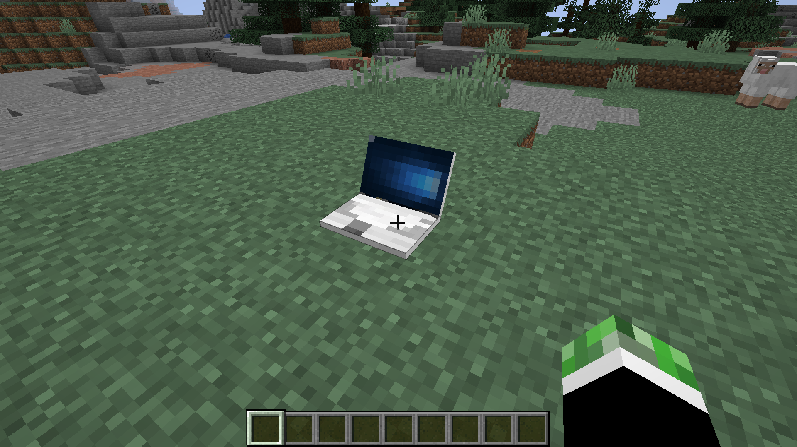

# VMCraft
Connect to virtual machines within Minecraft!

## Installation
1. Install [virt-viewer](http://virt-manager.org/download/)
2. For Windows and Mac users: Add the `bin` folder of your virt-viewer install to your PATH environment variable.
3. Download the [jarfile](https://github.com/Graeme22/VMCraft/releases) and place it in your Minecraft Forge `mods` folder.

## Setup (Developers)
1. Install [JDK 8](http://www.oracle.com/java/technologies/javase/javase-jdk8-downloads.html)
2. Install [Eclipse](http://eclipse.org)
3. Clone the repository: `git clone https://github.com/Graeme22/VMCraft.git`
4. Navigate to the folder and run `./gradlew genEclipseRuns`
5. Run `./gradlew eclipse` to setup the workspace.
6. In Eclipse, do File > Import > Existing Gradle Project, then follow the steps in the wizard.
7. Open Run > Run Configurations... > runClient > Environment. Edit the MOD_CLASSES field and replace all instances of "examplemod" with "vmcraft".
8. Click apply. You should now be able to run the project by clicking the green run button in eclipse.

To create a jarfile for release, run `./gradlew build` which will place the jarfile in the `build/libs` directory.

## Contributing
If you have any problems or have a contribution, please don't hesitate to open an issue or submit a pull request!
